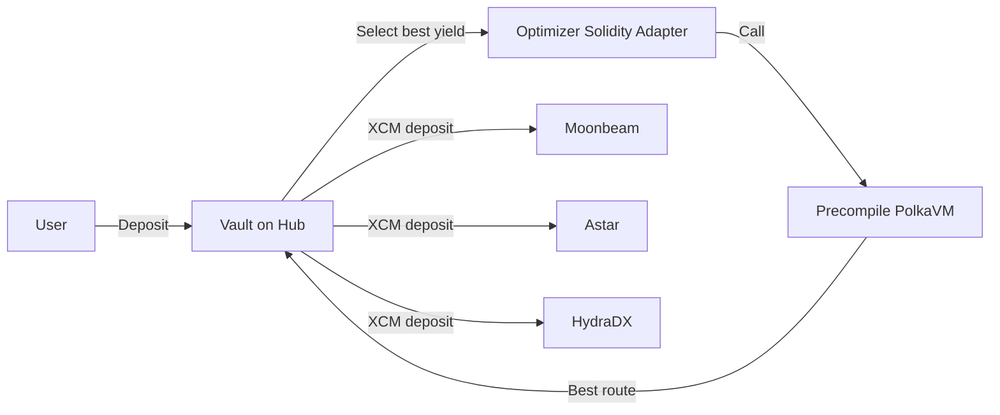

# ParaX Cross-Chain Yield Router

ParaX is a **Polkadot Hub vault** that routes deposits to the best yield strategy across parachains. Strategy selection is implemented in **Rust (PolkaVM-ready)** and invoked from Solidity via an adapter with a safe fallback.

---

## Track 2 (PVM Smart Contracts) mapping

| Requirement | Where it is in this repo |
|---|---|
| **Call Rust from Solidity (PVM-experiments)** | `contracts/src/StrategyOptimizerAdapter.sol` → calls a configurable optimizer target (`targetOptimizer`) and **falls back to Solidity** if unavailable |
| **Rust optimizer code** | `pvm/strategy_optimizer.rs` (same scoring logic as Solidity fallback) |
| **Cross-chain messaging (XCM)** | `contracts/src/XCMRouter.sol` (simulation mode + optional precompile call) |

---

## Architecture (where contracts live)

| Location | What lives there |
|---|---|
| **Polkadot Hub** | `Vault`, `StrategyManager`, `StrategyOptimizerAdapter`, optional `XCMRouter` |
| **Moonbeam / Astar / HydraDX** | One strategy contract per chain (demo uses `MockStrategy`) |

Users interact only with the **Vault on Polkadot Hub**.

### Simple flow diagram



**In one sentence:** user deposits to the **Vault**, the Vault uses Solidity (which can call a **precompile/PolkaVM optimizer**) to choose the best yield route, then deposits cross-chain to **Moonbeam / Astar / HydraDX** via XCM.

---

## Live deployment (for judges)

### Polkadot Hub TestNet (chainId `420420417`)

Deployed with `HUB_ONLY=true` and `SKIP_XCM_ROUTER=true` (workaround for Hub PUSH0/EIP-3855 incompatibility). Vault works normally; XCM notifications are skipped because `xcmRouter = address(0)`.

| Contract | Address |
|---|---|
| **Vault** | `0x66c121b94476E04bf660994BD959eF0C391BE1EE` |
| **StrategyManager** | `0x14A9CCaa2BaA18A516f89fC5a0Ec0d51ea305711` |
| **StrategyOptimizerAdapter** | `0x46739CD65046a5b15e4985b0Ef56B6568A56050D` |
| **Asset (Mock ERC20)** | `0xF10f3e5a7023ADae0b8C03A0b6C64f1439FB4220` |

- **RPC**: `https://services.polkadothub-rpc.com/testnet`
- **Explorer**: `https://blockscout-testnet.polkadot.io`

### Moonbeam (Moonbase Alpha, chainId `1287`)

| Contract | Address |
|---|---|
| **Strategy (Moonbeam)** | `0x2831b473b3D4b76bBaa6d90d01E7ad255c65F754` |
| **Asset (mock, for this strategy)** | `0x16aA6AC18AaC9BeD0f3839b1a19E95385eB298B1` |

---

## Chain IDs (clarity)

This repo currently stores **EVM chain IDs** for strategies (frontend display / RPC identity). In a production XCM deployment you would route using **parachain IDs**.

| Chain | EVM Chain ID | Parachain ID |
|---|---:|---:|
| Moonbeam | 1284 | 2004 |
| Astar | 592 | 2006 |
| HydraDX | 2034 | 2034 |

---

## How deposits & shares work (important)

- `totalShares`: total shares across **all users**.
- `userShares[user]`: shares owned by a specific user.
- User’s vault value (UI calculation): \(\frac{userShares}{totalShares} \times totalAssets\).

---

## Quick start (what most people need)

### Run frontend (reads on-chain data)

```bash
cd frontend
pnpm install
pnpm dev
```

Create `frontend/.env.local`:

```bash
NEXT_PUBLIC_VAULT_ADDRESS=0x66c121b94476E04bf660994BD959eF0C391BE1EE
NEXT_PUBLIC_STRATEGY_MANAGER_ADDRESS=0x14A9CCaa2BaA18A516f89fC5a0Ec0d51ea305711
NEXT_PUBLIC_XCM_ROUTER_ADDRESS=0x0000000000000000000000000000000000000000
NEXT_PUBLIC_WALLETCONNECT_PROJECT_ID=YOUR_WC_PROJECT_ID
```

Notes:
- The UI is configured to connect to **Polkadot Hub TestNet** by default.
- Deposits use the **Vault’s ERC20 asset** (the mock ERC20 above), not native PAS.

### Run contracts tests

```bash
cd contracts
forge test
```

### Run Rust tests

```bash
cd pvm
cargo test
```

---

## Deploy (Hub + parachains)

See **[DEPLOY.md](DEPLOY.md)** for exact commands and env vars.

High level:
- Deploy router stack on Hub with `DeployPolkadotHub.s.sol` (use `SKIP_XCM_ROUTER=true` on Hub).
- Deploy one strategy per parachain with `DeployParachainStrategy.s.sol`.
- Register each strategy address on Hub via `StrategyManager.addStrategy(...)`.

---

## License

MIT
