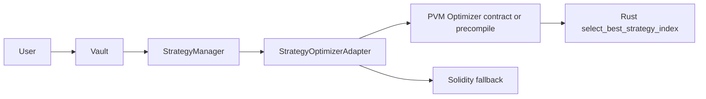
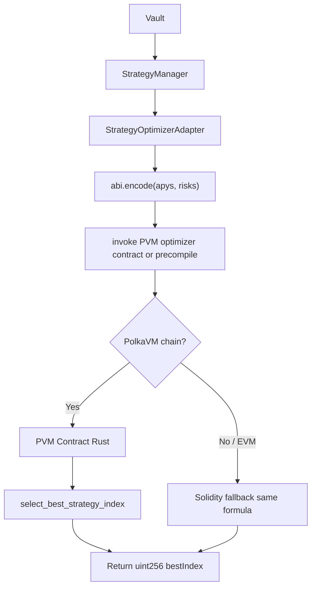
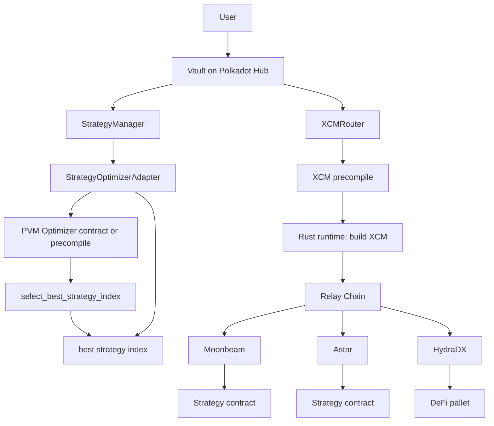

# ParaX Cross-Chain Yield Router

A DeFi yield routing system that automatically allocates user deposits to the highest-yielding strategy across Polkadot parachains (Moonbeam, Astar, HydraDX).

The optimizer is implemented in Rust and compiled for **PolkaVM**. Solidity delegates optimization logic to this Rust implementation through an adapter interface that can invoke a PolkaVM-enabled contract or precompile (as supported by the runtime). We prove ABI compatibility with a CLI; on a PolkaVM-enabled chain, the Rust code runs in PolkaVM and is accessed by the StrategyOptimizerAdapter.

---

## Track 2: PVM Smart Contracts — compliance

This project demonstrates the **PVM-experiments** category. Judges can map requirements to implementation as follows:

| Feature | Implementation |
|--------|----------------|
| **Solidity calling Rust** | StrategyOptimizerAdapter → Rust optimizer running in PolkaVM (via contract or precompile) |
| **Polkadot native messaging** | XCM precompile for cross-chain execution |
| **Cross-chain execution** | Moonbeam / Astar / HydraDX strategy contracts |
| **Heavy computation offloaded** | Rust optimizer running in PolkaVM |

---

## Intended architecture: where contracts live

| Location | Contracts |
|----------|-----------|
| **Polkadot Hub** | Vault, StrategyManager, StrategyOptimizerAdapter, XCMRouter (and optional PVM optimizer contract). **No strategy contracts on the Hub.** |
| **Moonbeam** | One strategy contract (e.g. MockStrategy or real yield strategy). |
| **Astar** | One strategy contract. |
| **HydraDX** | One strategy contract (or pallet target). |

Users interact only with the **Vault on Polkadot Hub**. The vault routes liquidity via XCM to the best strategy on the parachains; strategy selection uses the adapter (Rust on PolkaVM or Solidity fallback).

---

## Live deployment (for judges)

Live contracts are deployed on **Polkadot Hub** (router stack) and **Moonbeam** (parachain strategy). Addresses below are real and successfully deployed.

### Polkadot Hub (420420417) — live deployment

A **HUB_ONLY** deploy with **SKIP_XCM_ROUTER=true** was run on **Polkadot Hub TestNet** (chain 420420417). All four contracts deployed successfully. XCMRouter was skipped by design (Hub does not support PUSH0); the Vault has `xcmRouter = address(0)` and skips XCM in `rebalance()`, so deposits, withdrawals, and rebalancing work.

| Contract | Address |
|----------|---------|
| **Vault** | `0x66c121b94476E04bf660994BD959eF0C391BE1EE` |
| **StrategyManager** | `0x14A9CCaa2BaA18A516f89fC5a0Ec0d51ea305711` |
| **StrategyOptimizerAdapter** | `0x46739CD65046a5b15e4985b0Ef56B6568A56050D` |
| **Asset (Mock ERC20)** | `0xF10f3e5a7023ADae0b8C03A0b6C64f1439FB4220` |

- **Network:** Polkadot Hub TestNet, chain ID 420420417, RPC `https://services.polkadothub-rpc.com/testnet`. XCMRouter was skipped (`SKIP_XCM_ROUTER=true`); Vault has no XCM notifications on this chain.
- **Reproduce:** `export HUB_ONLY=true` and `export SKIP_XCM_ROUTER=true`, then run `DeployPolkadotHub.s.sol` with the Hub RPC (see [DEPLOY.md](DEPLOY.md)).
- **Broadcast:** `contracts/broadcast/DeployPolkadotHub.s.sol/420420417/run-latest.json`.

### Moonbeam (Moonbase Alpha, 1287) — live deployment

Strategy and asset deployed on **Moonbase Alpha** (Moonbeam testnet) via `DeployParachainStrategy.s.sol`. Register the strategy on the Hub with `StrategyManager.addStrategy(strategyAddr, apyBps, 1284, risk)`.

| Contract | Address |
|----------|---------|
| **Strategy (Moonbeam)** | `0x2831b473b3D4b76bBaa6d90d01E7ad255c65F754` |
| **Asset (mock, for this strategy)** | `0x16aA6AC18AaC9BeD0f3839b1a19E95385eB298B1` |

- **Network:** Moonbase Alpha, chain ID 1287, RPC `https://rpc.api.moonbase.moonbeam.network`.
- **Register on Hub:** `StrategyManager.addStrategy(0x2831b473b3D4b76bBaa6d90d01E7ad255c65F754, 1000, 1284, 2)` (example: 10% APY, chain ID 1284, risk 2).
- **Broadcast:** `contracts/broadcast/DeployParachainStrategy.s.sol/1287/run-latest.json`.

### Intended deployment (Hub + parachains)

1. **Polkadot Hub (router only)** — Set `HUB_ONLY=true` and `SKIP_XCM_ROUTER=true` (Hub does not support PUSH0, so XCMRouter is skipped), then run `DeployPolkadotHub.s.sol` with Hub RPC. Deploys: asset (or mock), Adapter, StrategyManager, Vault. No strategies on Hub.
2. **Moonbeam** — Run `DeployParachainStrategy.s.sol` with Moonbeam RPC. Note the strategy address.
3. **Astar** — Run `DeployParachainStrategy.s.sol` with Astar RPC. Note the strategy address.
4. **HydraDX** — Run `DeployParachainStrategy.s.sol` with HydraDX EVM RPC (if available). Note the strategy address.
5. **Register on Hub** — On the Hub, call `StrategyManager.addStrategy(moonbeamAddr, 800, 1284, 2)`, `addStrategy(astarAddr, 1200, 592, 4)`, `addStrategy(hydrationAddr, 1500, 2034, 7)` (EVM chain IDs: 1284, 592, 2034).

See **[DEPLOY.md](DEPLOY.md)** for RPC URLs, env vars, and optional `ASSET_ADDRESS`.

### Note for verification

- **XCMRouter and Polkadot Hub:** Polkadot Hub does not support **PUSH0** (EIP-3855), so XCMRouter deployment can revert there. Set **`SKIP_XCM_ROUTER=true`** when running `DeployPolkadotHub.s.sol` on Hub; the Vault receives `address(0)` and skips XCM in `rebalance()`, so deposits, withdrawals, and rebalancing still work.

---

## Project structure

```
yield-router/
├── contracts/              # Solidity (Vault, StrategyManager, adapter, strategies, XCMRouter)
│   ├── src/
│   └── script/             # DeployVault.s.sol, DeployPolkadotHub.s.sol, DeployParachainStrategy.s.sol, DemoScenario.s.sol
├── pvm/                    # Rust: strategy optimizer (PolkaVM contract source) + CLI proof
│   ├── strategy_optimizer.rs
│   └── src/bin/optimizer_cli.rs
├── frontend/               # Next.js app
└── backend/                # Auto-rebalance bot (cron)
```

---

## Why ParaX is interesting

Most cross-chain yield routers depend on off-chain routing oracles for strategy selection. ParaX performs strategy selection **on-chain**: the scoring logic runs as Rust compiled for PolkaVM, while Solidity orchestrates the Vault, StrategyManager, and XCM routing. This keeps optimization transparent and trust-minimized, and aligns with the PVM-experiments track (calling Rust from Solidity via an adapter that targets a PolkaVM-enabled contract or precompile).

---

## High-level flow



*Code:* Vault → `strategyManager.getBestStrategy()` → StrategyManager → `optimizer.getBestStrategyIndex(apys, risks)` → Adapter tries `targetOptimizer.staticcall(encoded)` (PVM contract or precompile, as supported by runtime); if the call fails, reverts, or returns invalid data, Solidity fallback runs.

- **User** → **Vault** (Polkadot Hub). Vault → **StrategyManager** → **StrategyOptimizerAdapter**.
- **Adapter** delegates to the Rust optimizer running in PolkaVM (when available via the runtime); otherwise the **Solidity fallback** runs.
- The adapter falls back to the Solidity implementation if the call fails, reverts, or returns invalid data—so the system works on standard EVM chains during development and on PolkaVM-enabled chains when the runtime supports the optimizer.

---

## PVM: Solidity and Rust (Track 2)

Solidity does not assume a direct EVM→PVM call; it uses an **adapter interface** that can target a PolkaVM-enabled contract or precompile, as the runtime provides. The flow is:

**Solidity Adapter** → (runtime-supported path) → **Rust optimizer** running in PolkaVM → `select_best_strategy_index`

The Rust code in `pvm/` is compiled for PolkaVM and can be deployed as a contract or exposed via a precompile; the adapter calls `targetOptimizer` (constructor-set address). On EVM without that target, or if the call fails, reverts, or returns invalid data, the adapter falls back to the Solidity implementation.

### Current vs target

| Today (EVM) | On PolkaVM (target) |
|-------------|----------------------|
| Adapter’s `staticcall(targetOptimizer, ...)` fails (no contract at address) → Solidity fallback runs | Adapter invokes the Rust optimizer at `targetOptimizer` (contract or precompile); returns `uint256` best index |
| Rust in `pvm/` used in tests + CLI proof | Same Rust compiled for PolkaVM, deployed or exposed by runtime, invoked via adapter |

### Architecture (adapter path)



*Code:* Adapter encodes with `abi.encode(apys, risks)`, then `targetOptimizer.staticcall(encoded)`. On success and valid index, return it; if the call fails, reverts, or returns invalid data, compute best index in Solidity (`_score`).

### Deploying the PVM contract

1. **Source:** `pvm/` (e.g. `strategy_optimizer.rs`) implements `select_best_strategy_index` and `compute_score`.
2. **Build:** Compile the Rust code to **PolkaVM bytecode** (e.g. via cargo-pvm-contract or chain tooling).
3. **Deploy:** Deploy the resulting PVM contract on **Polkadot Hub**; note its address.
4. **Wire:** Pass that address to `StrategyOptimizerAdapter` constructor (`_optimizer`). The adapter **calls the optimizer PVM contract** at `targetOptimizer`; on EVM use `address(0)` so fallback runs.

### PVM crate (`pvm/`)

- **`strategy_optimizer.rs`** — Logic for the PVM optimizer contract: `select_best_strategy_index(apys, risks) -> u32`, `compute_score(apy, risk) -> i64`. Formula: `score = apy - (risk * 100)`; tie-break: first highest wins.
- **`src/bin/optimizer_cli.rs`** — Proof of ABI compatibility: same calldata Solidity would send → decode → Rust → ABI-encoded `uint256`. On PolkaVM, the **deployed PVM contract** would execute this logic when called by the adapter.

### ABI contract (Solidity ↔ Rust)

- **Input:** `abi.encode(uint256[] apys, uint256[] risks)`; values must fit in `u32`.
- **Output:** single `uint256` = best index.
- **Formula:** `score = apy - (risk * 100)`; first max wins.
- Same test vectors in `contracts/test/StrategyOptimizerAdapter.t.sol` and `pvm/strategy_optimizer.rs` so both sides stay in sync.

---

## Target architecture (Track 2 aligned)

**Polkadot Hub** = router + PVM optimizer contract + XCM; **parachains** = where yield strategies live; **XCM** = how messages move. Precompile/contract addresses must be verified from the chain runtime configuration or official documentation before deployment.

Cross-chain execution benefits from **Polkadot’s shared security model**: the relay chain validates parachain state transitions and guarantees delivery of XCM messages.

### Chain IDs vs Parachain IDs

The repository currently stores **EVM chain IDs** for strategy identification. These are **not** Polkadot parachain IDs.

- **EVM chain IDs** are used for:
  - frontend network identification (e.g. wallet/RPC)
  - Solidity contracts (strategy identity and display)
  - RPC configuration

- **Parachain IDs** are used for:
  - **XCM routing** on the Polkadot relay
  - cross-chain messaging in the Polkadot ecosystem

| Chain    | EVM Chain ID | Parachain ID |
|----------|---------------|--------------|
| Moonbeam | 1284          | 2004         |
| Astar    | 592           | 2006         |
| HydraDX  | 2034          | 2034         |

- **Moonbeam** parachain ID = **2004**; EVM chain ID = **1284**.
- **Astar** parachain ID = **2006**; EVM chain ID = **592**.
- **HydraDX** parachain ID = **2034** (Substrate-native; no separate EVM chain ID in this table, so 2034 is used as the chain identifier in the repo for HydraDX).

In this repository, strategies store **EVM chain IDs** for network identity and frontend display. In a production deployment, the XCM router would instead route messages using **parachain IDs** obtained from the Polkadot network configuration.

### Cross-chain flow (step-by-step)

1. **User** → **Vault** (Polkadot Hub)  
2. **Vault** → **StrategyManager**  
3. **StrategyManager** → **StrategyOptimizerAdapter**  
4. **Adapter** → Rust optimizer (PolkaVM contract or precompile)  
5. Optimizer returns best strategy index  
6. **Vault** → **XCMRouter** (routing logic) → **XCM precompile**  
7. **XCM precompile** → Relay Chain  
8. **Relay** → Moonbeam / Astar / HydraDX  
9. **Destination strategy** executes (deposit, stake, or pallet call)

### Real cross-chain strategy examples

| Chain | Parachain ID (example) | Strategy example |
|-------|------------------------|------------------|
| Moonbeam | 2004 | GLMR staking |
| Astar | 2006 | ASTR staking |
| HydraDX | 2034 | Liquidity pools |

(Parachain IDs and strategy types depend on the network; verify in chain docs.)

#### Strategy struct and chainId

The current **Strategy** struct stores a single `chainId` field, which in this repository represents the **EVM chain ID** (used for network identity and frontend display). For production cross-chain deployments, a design could separate the two concepts:

- **`evmChainId`** — identifies the network for RPC and frontend (e.g. 1284, 592).
- **`parachainId`** — used for **XCM routing** when sending messages via the relay (e.g. 2004, 2006, 2034).

Example production-style struct (documentation only; current contracts are unchanged):

```
struct StrategyInfo {
    address strategy;
    uint32 evmChainId;   // network identity, frontend, RPC
    uint32 parachainId; // XCM routing on Polkadot
    uint256 apy;
    uint256 riskScore;
    bool active;
}
```

### Chains and roles

| Chain | Role | What lives here |
|-------|------|------------------|
| **Polkadot Hub** | Source / router | Vault, StrategyManager, StrategyOptimizerAdapter, **PVM optimizer contract** (Rust); calls **XCM precompile** |
| **Relay Chain** | Transport | No deployment; relays XCM messages |
| **Moonbeam** | Destination (EVM) | Strategy contract (e.g. GLMR staking) |
| **Astar** | Destination | Strategy contract (e.g. ASTR staking) |
| **HydraDX** | Destination (DeFi) | Liquidity pools / runtime pallet |

### End-to-end flow (target)



*Code:* Strategy path: Vault → StrategyManager.getBestStrategy() → Adapter.getBestStrategyIndex() (invokes `targetOptimizer` when runtime supports it; else fallback). XCM path (during rebalance): Vault → XCMRouter.sendXCM(); when `xcmPrecompile != 0` XCMRouter calls the precompile, then XCMRouter always emits XCMTransfer.

- **User** deposits on Polkadot Hub into the **Vault**.
- **StrategyManager** gets best strategy index via **Adapter** → Rust optimizer (PolkaVM) or Solidity fallback.
- When rebalancing **across chains**, **Vault** calls **XCMRouter**.sendXCM(); **XCMRouter** calls the **XCM precompile** (when `xcmPrecompile` is set). In this demo implementation, the `chainId` passed to the router refers to **EVM chain IDs** (stored per strategy). In production, the XCM router would instead use **parachain IDs** for cross-chain messaging. The payload used in this repo is a **simplified** example: `abi.encode(fromChain, toChain, strategy, amount)`. Real XCM messages typically include additional parameters such as execution weight limits, fee assets, and origin context; the example is for demonstration only.
- **XCM precompile** is part of the Hub runtime; it builds the XCM message and sends it via the relay.
- **Destination chain** receives the message and executes the target contract or pallet.

### Where precompile / contract addresses come from

- **XCM precompile** and other runtime precompiles: addresses are **defined in the chain runtime** (Rust config). Get them from **chain documentation** or **runtime source** (e.g. `precompiles.rs`, `mod.rs`). **Addresses must be verified from the chain runtime configuration or official documentation before deployment.**
- Typical range on Substrate EVM chains: `0x...0800`, `0x0801`, `0x0802`… (e.g. 2048 = 0x0800).
- **PVM optimizer**: the Rust code in `pvm/` is compiled to PolkaVM bytecode and **deployed as a PVM smart contract** on Polkadot Hub. Pass that contract’s address to `StrategyOptimizerAdapter` constructor; use `address(0)` for EVM (adapter then uses default `PVM_OPTIMIZER` and fallback runs).

### What you deploy and where

| Component | Chain | Who deploys |
|-----------|--------|-------------|
| Vault, StrategyManager, StrategyOptimizerAdapter, XCMRouter (optional on Hub; use `SKIP_XCM_ROUTER=true` if XCMRouter cannot be deployed) | **Polkadot Hub** | You (Solidity) |
| **PVM optimizer contract** (Rust → PolkaVM bytecode) | **Polkadot Hub** | You (deploy PVM contract) |
| Strategy contracts or pallet targets | **Moonbeam, Astar, HydraDX** | You (or use existing pallets) |
| XCM precompile | Polkadot Hub runtime | Chain (already there) |

The **PVM optimizer** is a **smart contract** you deploy (Rust compiled for PolkaVM), not a runtime precompile. The XCM precompile is provided by the chain.

### Deployment order (target)

1. **Destination chains**  
   Deploy or wire strategy contracts on Moonbeam (e.g. parachain 2004), Astar (2006), HydraDX (2034). Record contract addresses and parachain ids.

2. **Polkadot Hub — PVM contract**  
   Compile `pvm/` to PolkaVM bytecode; deploy the optimizer as a PVM smart contract on the Hub. Note its address.

3. **Polkadot Hub — Solidity**  
   Deploy Vault, StrategyManager, StrategyOptimizerAdapter, XCMRouter. Pass the **deployed PVM contract** address to `StrategyOptimizerAdapter` constructor; pass the **XCM precompile** address (from Hub docs) to `XCMRouter` constructor. For EVM simulation use `address(0)` for both.

4. **User flow**  
   User interacts only with the Vault on Polkadot Hub; rebalance and XCM go through your contracts and the XCM precompile.

---

## Plan to align with target architecture

| Current state | Target | Action |
|---------------|--------|--------|
| Single EVM; all strategies on same chain | Vault on Polkadot Hub; strategies on Moonbeam / Astar / HydraDX | Deploy Vault + adapter on Hub; deploy or connect strategy contracts on each parachain; StrategyManager stores (address, chainId, apy, risk) per chain |
| XCMRouter: pass precompile in constructor | Real cross-chain via XCM | When `xcmPrecompile != 0`, `sendXCM` **calls** the precompile then emits; pass address from Hub docs to `XCMRouter` constructor |
| Adapter: pass optimizer in constructor | Adapter calls **PVM optimizer contract** | Compile `pvm/` to PolkaVM bytecode; **deploy as PVM contract** on Hub; pass that address to `StrategyOptimizerAdapter` constructor; use `address(0)` on EVM for fallback |
| MockStrategy on same chain | Real strategies on parachains | Use real yield contracts/pallets (e.g. Moonbeam GLMR staking, Astar ASTR staking, HydraDX liquidity); Vault triggers XCM to deposit into strategy on destination chain |

**Concrete next steps**

1. **XCM precompile**: get address from Polkadot Hub docs or runtime; verify from chain runtime configuration or official documentation before deployment.
2. **PVM contract**: build Rust optimizer to PolkaVM bytecode; deploy on Hub; pass that address to `StrategyOptimizerAdapter` constructor.
3. **XCM path**: when rebalancing to another chain, Vault → XCMRouter → XCM precompile with parachain id (e.g. 2004, 2006, 2034) and encoded call.
4. **Destination strategies**: deploy or integrate contracts on Moonbeam, Astar, HydraDX; register in StrategyManager with correct `chainId` and addresses.

---

## Quick start

### 1. Deploy contracts

**Local / single EVM chain (e.g. Anvil or Moonbase):**

```bash
cd contracts
forge install
export PRIVATE_KEY=0x...
# ASSET_ADDRESS is optional; if unset, script deploys a mock ERC20 and mints to deployer
forge script script/DeployVault.s.sol --rpc-url $RPC_URL --broadcast
```

**Polkadot Hub (qualification) and parachains:**  
Use the dedicated scripts and set `PRIVATE_KEY`, `ASSET_ADDRESS`, and the chain RPC. See **[DEPLOY.md](DEPLOY.md)** for:
- **Script 1 — Hub:** `DeployPolkadotHub.s.sol` (Vault, StrategyManager, Adapter, optional XCMRouter; use `SKIP_XCM_ROUTER=true` on Polkadot Hub so the stack deploys without XCMRouter).
- **Script 2 — Parachains:** `DeployParachainStrategy.s.sol` (one MockStrategy per chain; run once per chain with that chain’s RPC and asset).
- Required env vars, RPCs, and how to register parachain strategies on the Hub.

### 2. Run frontend

```bash
cd frontend
pnpm install
pnpm dev
```

The app is configured to connect to **Polkadot Hub TestNet** (chain ID 420420417) by default. When you connect your wallet, it will prompt for Polkadot Hub; set `NEXT_PUBLIC_VAULT_ADDRESS` and `NEXT_PUBLIC_STRATEGY_MANAGER_ADDRESS` to your Hub deployment addresses (see [Live deployment](#live-deployment-for-judges)).

### 3. Auto-rebalance bot (optional)

```bash
cd backend
npm install && cp .env.example .env
# Set RPC_URL, VAULT_ADDRESS, STRATEGY_MANAGER_ADDRESS, PRIVATE_KEY in .env
npm run build && npm start
```

The bot runs every 10 minutes: it compares the Vault’s current strategy with `getBestStrategy()`, and calls `rebalance()` when a better strategy is available.

---

## Demo flow

### EVM: deposit → best strategy → rebalance

1. Deploy (see above), then run the full scenario:

```bash
cd contracts
forge script script/DemoScenario.s.sol --rpc-url $RPC_URL --broadcast --private-key $PRIVATE_KEY -vvvv
```

2. Expected: user deposits → system selects best strategy by score (APY − risk×100); when APY changes, rebalance moves funds to the new best strategy.

### Track 2 proof: Solidity ABI ↔ Rust

1. Generate the same payload the adapter would send:

```bash
cast abi-encode "f(uint256[],uint256[])" "[800,1200,1500]" "[2,4,7]"
```

2. Run the Rust CLI (paste the hex from the previous command):

```bash
cd pvm
cargo run --bin optimizer_cli -- <HEX_FROM_CAST>
```

3. Expected output: 32-byte hex with value `1` (scores 600, 800, 800 → first max at index 1). This proves the Rust side decodes and computes the same result as the Solidity fallback.

---

## Testing and verification

### Solidity (75 tests)

```bash
cd contracts
forge test
```

Covers: Vault, StrategyManager, StrategyOptimizerAdapter (including Rust parity), XCMRouter (simulation vs production precompile call), integration and edge cases.

### Rust (7 tests)

```bash
cd pvm
cargo test
```

### One-shot verification checklist

1. **Solidity:** `cd contracts && forge test` → 75 tests pass.
2. **Rust:** `cd pvm && cargo test` → 7 tests pass.
3. **ABI proof:** `cast abi-encode "f(uint256[],uint256[])" "[800,1200,1500]" "[2,4,7]"` then `cd pvm && cargo run --bin optimizer_cli -- <hex>` → output ends with `...01`.

---

## End-to-end architecture summary

```
User
  ↓
Vault
  ↓
StrategyManager
  ↓
Adapter
  ↓
Rust Optimizer (PolkaVM or fallback)
  ↓
Best Strategy
  ↓
Strategy / XCM Router
```

### Deployment

With **DeployVault.s.sol**: Adapter → StrategyManager → Strategies → XCMRouter → Vault; then the owner registers each strategy. With **DeployPolkadotHub.s.sol** (Hub): optional XCMRouter (or skip with `SKIP_XCM_ROUTER=true`) → Adapter → StrategyManager → Vault; no strategies on Hub when `HUB_ONLY=true`. If **`_optimizer == address(0)`**, the adapter defaults to **PVM_OPTIMIZER**; on standard EVM this address has no code, so the adapter falls back to the Solidity implementation.

### Deposits

User sends asset to the Vault and receives shares (1:1 on first deposit, proportional thereafter). The Vault calls **StrategyManager.getBestStrategy()** to decide where to allocate; on first deposit funds go to that best strategy and **currentStrategy** is set; on later deposits funds go to the **current** strategy only (rebalancing is explicit).

### Best-strategy selection

StrategyManager builds **apys** and **risks** from active strategies and calls **Adapter.getBestStrategyIndex(apys, risks)**. The adapter encodes the arrays and invokes **targetOptimizer** (contract or precompile). If the call fails, reverts, returns invalid data, or returns an out-of-range index, the adapter falls back to the Solidity implementation (same formula: score = apy − risk×100; first highest wins). StrategyManager maps the returned index back to a strategy address.

### Rebalance (owner-only)

Vault gets the best strategy; if it differs from **currentStrategy**, it withdraws from the old strategy and deposits into the new one. The Vault requests withdrawal of the strategy’s available assets (e.g. using **asset.balanceOf(currentStrategy)** in the mock implementation). XCM routing is triggered during rebalancing when funds move between strategies located on different chains: Vault calls **XCMRouter.sendXCM(fromChain, toChain, strategy, amount)** only when **xcmRouter != address(0)** (e.g. on Hub with `SKIP_XCM_ROUTER=true`, the Vault has `xcmRouter = address(0)` and skips this call). If **xcmPrecompile == address(0)** the router only emits **XCMTransfer**; when **xcmPrecompile** is set, the router calls the precompile then emits.

The current implementation uses **EVM chain IDs** (1284, 592, 2034) to identify strategies. In a production cross-chain deployment, the XCM router would instead use **parachain IDs** (e.g. Moonbeam 2004, Astar 2006, HydraDX 2034).

### Withdrawals

User burns shares and receives a proportional amount of assets (including any simulated yield). Withdrawals are capped by the actual token balances held in the Vault and the current strategy, ensuring the system never promises more assets than it can immediately return. The Vault may pull from the current strategy to cover the payout.

### MockStrategy and Rust

**MockStrategy** implements **StrategyBase**; **totalAssets()** returns principal plus simulated yield (APY-based). The yield is simulated for testing: no time component or external protocol is used. This allows deterministic tests of the strategy-selection and rebalance logic. The **Rust** implementation in **pvm/** mirrors the Solidity fallback logic exactly, ensuring deterministic parity between the PVM optimizer and the fallback path; it is used by tests and the CLI for ABI proof.

---

## Key features

- Automatic strategy selection (score = APY − risk×100); tie-break: first highest.
- **PolkaVM**: Rust optimizer in `pvm/` compiles for PolkaVM; Solidity delegates to it via an adapter that can call a PolkaVM-enabled contract or precompile, with a Solidity fallback when the call fails, reverts, returns invalid data, or returns an out-of-range index.
- Dynamic rebalancing; XCM transfer simulation (events); optional auto-rebalance bot.
- Shared test vectors in Solidity and Rust for parity between fallback and PVM path.

---

## Security

- ReentrancyGuard; SafeERC20; owner-only rebalance; tests for core flows.

---

## License

MIT
